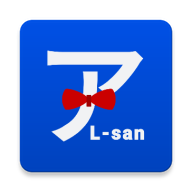
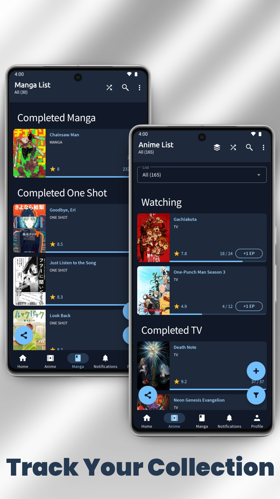
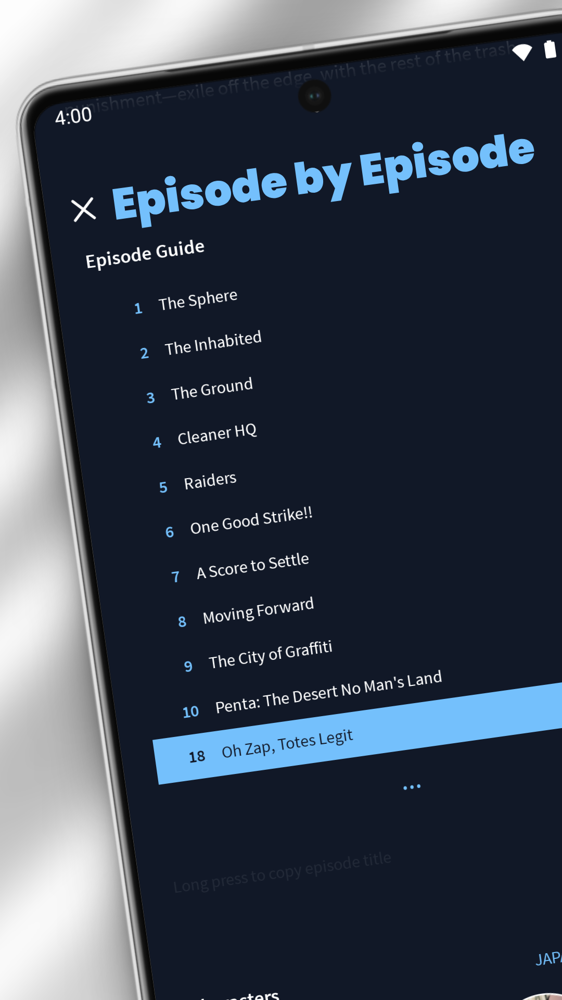
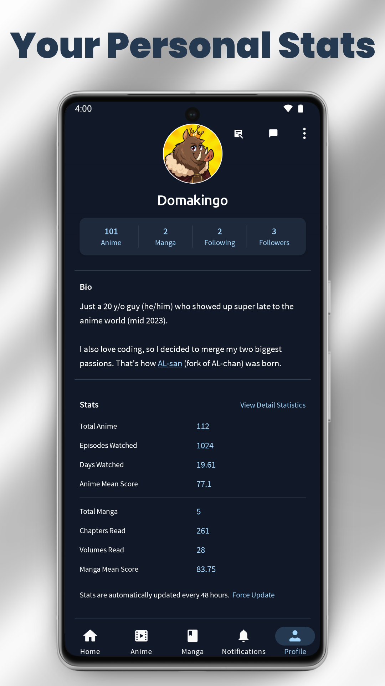
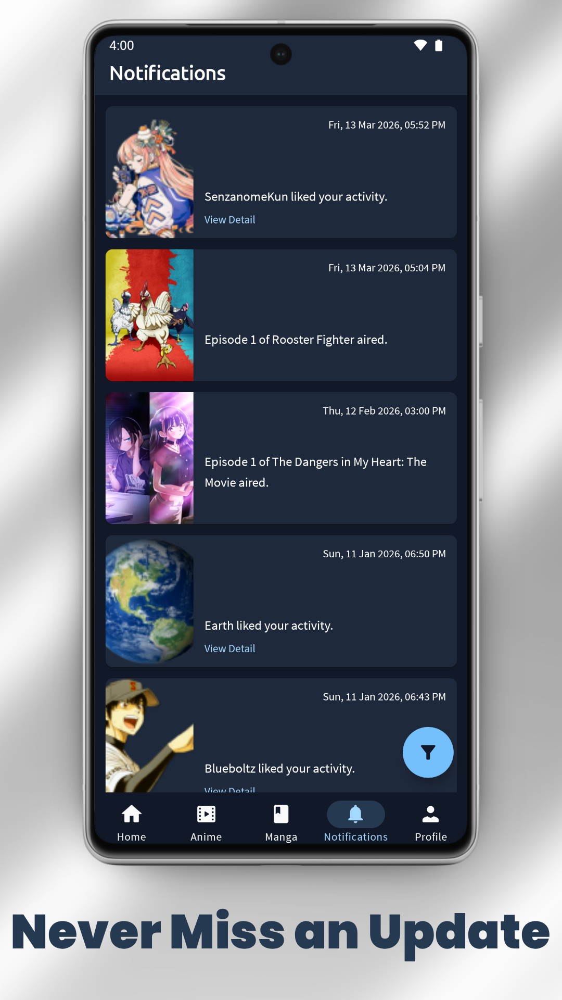

<h1 align="center">AL-san</h1>

  

AL-san is an unofficial fork of AL-chan, an unofficial Android client for AniList, a place where you can track, share, discover, and experience Anime and Manga.

  
  
  
  

## Features so far
- Manage your anime and manga lists.
- Support various types of scoring method and custom lists.
- Customise your anime and manga lists.
- Find out your anime's release schedule.
- See the most popular and the highest rated anime and manga.
- Seasonal chart to see what anime are coming next.
- Search for anime, manga, characters, staffs, and studios.
- View detailed info of anime, manga, characters, staffs, and studios.
- Robust stats based on your anime and manga lists.
- View recommendations and read reviews.
- Interact with the community.
- Light and Dark theme.

## Authors
- **[zend10](https://github.com/zend10)** - Original creator of AL-chan
- **[Domakingo](https://github.com/Domakingo)** - Unofficial fork maintainer (AL-san)

## Contributing (Important)
- Create new Issue, explain your plan, and mention that you're planning to work on it.
- Wait for my confirmation. Only start working after I approve it, for both our sake. 
- Branch out from `master`.
- For example, assuming the latest version is `v3.2.0`, target your Pull Request to `version/3.2.1`. Check Releases page to find the latest version.
